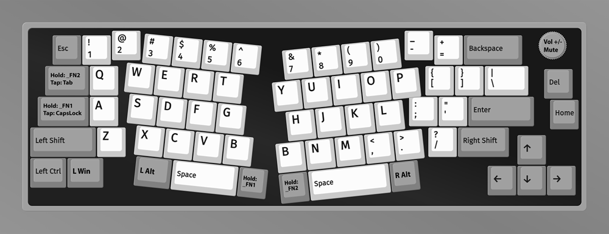
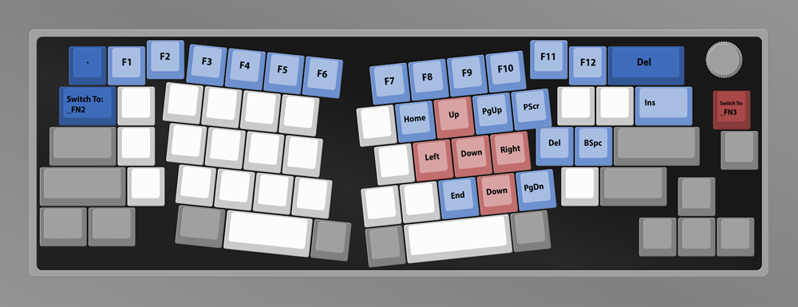
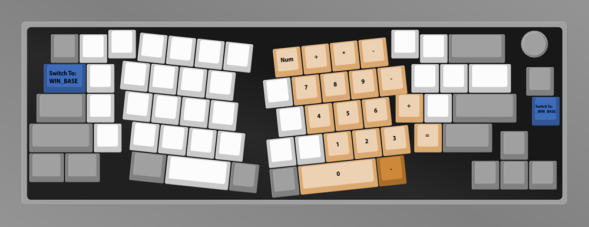
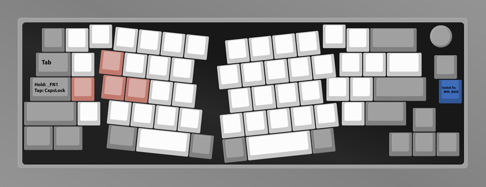

# QMK_V8
Custom QMK Keymap for Keychron V8 (Alice Layout) ANSI Encoder

## Instructions

1. Set up [QMK](https://docs.qmk.fm/#/newbs_getting_started)
2. Copy **semicharmed** folder to **\qmk_firmware\keyboards\keychron\v8\ansi_encoder\keymaps\**
3. Edit **keymap.c** to taste
4. [Compile](https://docs.qmk.fm/#/newbs_building_firmware)
5. Flash with [QMK Toolbox](https://github.com/qmk/qmk_toolbox) as per [Keychron instructions](https://www.keychron.com/blogs/archived/how-to-factory-reset-or-flash-your-qmk-via-enabled-keychron-v8-keyboard)

